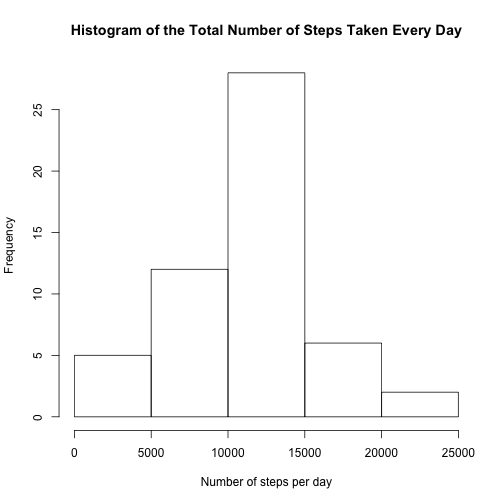
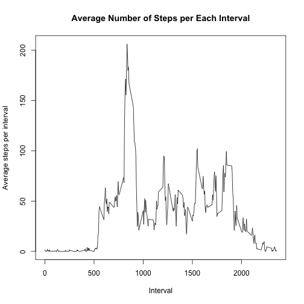
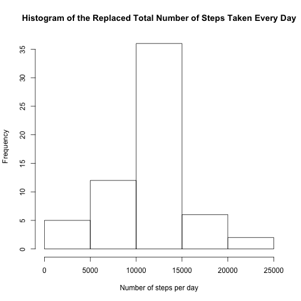
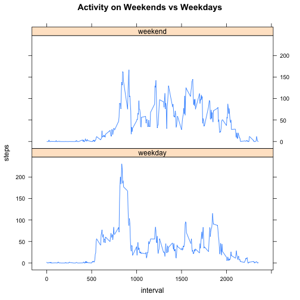

This is an R Markdown document that contains the Peer Assignment 1 for Reproducible Research course on Coursera.
The goal of this task is to learn how to document code in R Markdown in order to make the code readable by humans. Explanations of the approch for solving this task will be followed by the actual R code.


The process of getting and cleaning and analyzing data is illustrated below with the code chunks. 

##**Loading and preprocessing the data**. 
We open the dataset using read.csv command and load a ploting system.

```r
indata <- read.csv('~/Documents/RepData_PeerAssessment1/activity.csv', header = TRUE)
library(knitr)
library(lattice) 
```

##**What is mean total number of steps taken per day?**
We beguin by calculating the number of steps for each interval

```r
total_steps <- aggregate(. ~ date, data=indata, FUN=sum)
```

Let's illustrate the daily distribution of steps over time intervals with a histogram:

```r
hist(total_steps$steps, xlab="Number of steps per day", main="Histogram of the Total Number of Steps Taken Every Day")
```

 

Now we can calculate the mean and median for the total number of steps taken every day:

```r
mean_steps <- mean(total_steps$steps)
median_steps <- median(total_steps$steps)
```

Here is the output of the mean and median of steps:

```r
mean_steps 
```

```
## [1] 10766.19
```

```r
median_steps 
```

```
## [1] 10765
```


##**What is the average daily activity pattern?**
In order to answer this question, let's calculate average number of steps for each interval and then construct a time-space plot using this data:

```r
average_steps <- aggregate(. ~ interval, data=indata, FUN=mean) 

plot.ts(average_steps[,1], average_steps[,2], xlab='Interval', ylab='Average steps per interval', type='l', main= "Average Number of Steps per Each Interval")
```

 

Let's identify which interval contains the maximum number of steps:

```r
maximum_steps_per_interval <- max(average_steps$steps)
maximum_steps_per_interval
```

```
## [1] 206.1698
```

##**Imputing missing values**
First, let's create a copy of our dataset "indata" and then loop through the dataset replacing all NA values with a value that equals to the average number of steps for the corresponding interval. Then, we will recalculate the total steps value:

```r
newdata <- indata 

for (i in 1:nrow(indata)){
  if (is.na(indata[i, "steps"])){
    newdata[i, "steps"] <- average_steps$steps[average_steps$interval==newdata[i, "interval"]] 
  }
}
new_total_steps <- aggregate(. ~ date, data=newdata, FUN=sum)
```

And now let's build a histagram of total number of steps taken each day:

```r
hist(new_total_steps$steps, xlab="Number of steps per day", main="Histogram of the Replaced Total Number of Steps Taken Every Day")
```

 

Also, we can calculate mean and median values for total number of steps taken each day.

```r
new_mean_steps <- mean(new_total_steps$steps)
new_median_steps <- median(new_total_steps$steps)
```


```r
new_mean_steps
```

```
## [1] 10766.19
```

```r
new_median_steps
```

```
## [1] 10766.19
```

##**Are there differences in activity patterns between weekdays and weekends?**
We will start by creating a variable for storing data that indicates if a day is a weekday or a weekend (by converting ata into "0" and "1") and attaching this new vector to our dataset:

```r
day <- as.numeric(weekdays(as.Date(indata$date))=='Sunday') + as.numeric(weekdays(as.Date(indata$date))=='Saturday') 

augmentdata <- cbind(newdata, day)
```

Now let's sort our data into two groups by identifying if data belongs to weekdays("0") or weekends("1"):

```r
augmentdata$day[augmentdata$day == 0] <- "weekday"
augmentdata$day[augmentdata$day == 1] <- "weekend"
```

We partition the dataset into weekday data and the weekend data and find the average steps per interval for each partician (subset) separately. "Day" is meant to reattach the weekday factor variable to the resulting average steps dataframes so that later we can use it to make a panel plot:

```r
weekday_data <- augmentdata[augmentdata$day == "weekday", ]

weekday_average_steps <- aggregate(steps ~ interval, data=weekday_data, FUN=mean)

day <- vector(, nrow(weekday_average_steps))

day[] <- 'weekday'

weekday_average_steps <- cbind(weekday_average_steps, day)

weekend_data <- augmentdata[augmentdata$day == "weekend", ]

weekend_average_steps <- aggregate(steps ~ interval, data=weekend_data, FUN=mean)

day <- vector(, nrow(weekend_average_steps))

day[] <- 'weekend'

weekend_average_steps <- cbind(weekend_average_steps, day)
```

Finally, we are pulling together the final dataset and build a  panel plot of two graphs that illustrates activity of the subject on the weekends and on weekdays on average.

```r
finaldata <- rbind(weekday_average_steps, weekend_average_steps)

xyplot(steps ~ interval | day, data=finaldata, type='l', layout=c(1,2), main="Activity on Weekends vs Weekdays")
```

 

By looking at the panel plot, we can tell the difference between the weekend and weekday activity. As we can see, the subject of the test tends to take more steps in approximately 530 to 1900 intervals. However, around 1830 interval the subject seem to be more active on weekdays.

